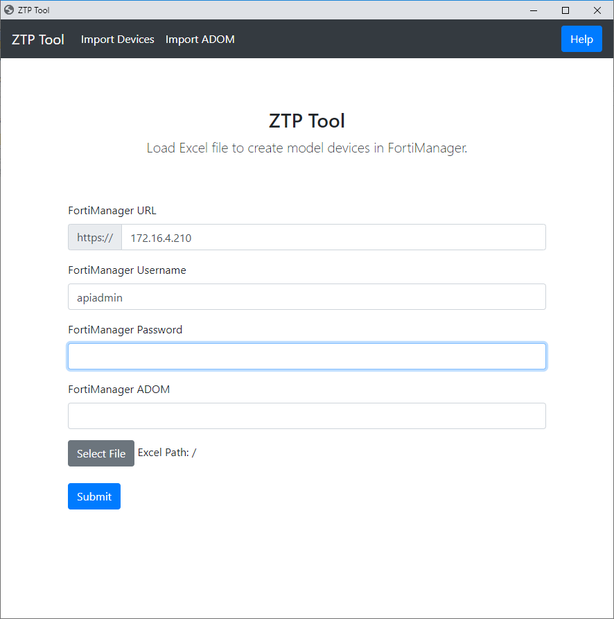

# ZTP Tool

ZTP Tool is a small GUI application to assist with setting up Fortinet FortiManager for Zero Touch Provisioning (ZTP) of SD-WAN deployments. ZTP Tool has two main functions:

1) Import devices from an Excel file (Model Device with Meta Data, CLI Templates, SD-WAN templates and Policy Packages applied)
2) Import ADOM from JSON file (with CLI Templates, SD-WAN Templates and Policy packages in place)

Downloads are available on the [releases](https://github.com/tmorris-ftnt/ztptool/releases) page.

- [ZTP Tool](#ztp-tool)
  * [Getting Started with demo_example](#getting-started-with-demo_example)
  * [ZTP Tool workflow](#ztp-tool-workflow)
  * [Excel File Format](#excel-file-format)
    + [Required Fields](#required-fields)
      - [Device_Name](#device_name)
      - [Platform](#platform)
      - [Device_SN](#device_sn)
      - [Upgrade_Ver](#upgrade_ver)
      - [CLI_Template](#cli_template)
      - [Post_CLI_Template](#post_cli_template)
      - [SDWAN_Template](#sdwan_template)
      - [Policy_Package](#policy_package)
    + [Optional Device Fields](#optional-device-fields)  
      - [Device_Adminpassword](#device_adminpassword)
      - [Device_Group](#device_group)
      - [Device_Longitute](#device_longitute)
      - [Device_Latitute](#device_latitute)
      - [Cert_Template](#cert_template)      
    + [Dynamic Fields](#dynamic-fields)
      - [meta_value](#meta_value)
      - [dint_value](#dint_value)
      - [daddr_value](#daddr_value)
      - [daddr6_value](#daddr6_value)
      - [sdwanint_value|suffix](#sdwanint_valuesuffix)
  * [Settings](#settings)
  * [Export ADOM](#export-adom)
  * [Import ADOM](#import-adom)
  * [MacOS and Linux Support](#macos_and_linux_support)

## Getting Started with demo_example

> Included examples only works for FortiManager 6.2.1 and 6.2.2

Extact the files from the .zip archive somewhere on your computer.
Note: Chrome must be installed the computer.

Create an user on FortiManager version 6.2.1+ with `<rpc-permit read-write>` permissions set with ADOM mode enabled. 

Open ztptool.exe.

Goto the Import ADOM page and fill in the form and select the demo_example.json file.

This will setup your new ADOM with CLI Templates, SDWAN Templates, Policy Packages and Objects. 

Now goto the Import Devices Page. 

Fill in the form and select the demo_example.xlsx file. 

This will populate your FortiManager ADOM with prebuild model devices. 

## ZTP Tool workflow

Before Device Setup
1) Load Excel file
2) Login to FortiManager
3) Run validity check on FortiManager and the Excel File
4) Create any meta fields which do not already exist

Per Device Setup
1) Create Model Device
2) Assign meta fields to device
3) Assign initial CLI Template/Group to device
4) Run Device Install to apply CLI Template
5) Unassign Initial CLI Template/Group
6) Assign Dynamic SD-WAN Template and Policy Package Objects
7) Assign SD-WAN Template
8) Assign Policy Package
9) Assign Post CLI Template/Group
10) Install Policy Package and Device Settings

## Excel File Format

The Excel file must be in .xlsx (Excel 2010) format. It should contain a tab called "Devices" with header fields in row1 and device info in row2 and beyond.

> Note: ZTP Tool will continue to process rows until it detects 3 blank rows. 

### Required Fields
the following fields have specific meaning in ZTP Tool and are required in order for the excel file to load.

#### Device_Name
This field will indicate the devicename to assign in FortiManager

> This field will also be copied to a meta field called "Device_Name"

#### Platform
This field will assign the Platform (i.e. FortiGate-60E). 

Use the CLI command `diagnose dvm supported-platforms list` on FortiManager to get  list of supported Device Types.

#### Device_SN
This field will assign the serial number for the device.

> This field will also be copied to a meta field called "Device_SN"

#### Upgrade_Ver
This field will specify the Firmware version to upgrade to when the device connects to FortiManager. 

Example Value: "6.2.2-b1010" for FortiOS 6.2.2 build 1010

> Leave blank to not enforce firmware upgrade.

#### CLI_Template
This will assign the CLI Template Group to the device. This CLI Template will be applied before SD-WAN Templates or Policy Packages/ADOM configuration. Any objects such as interfaces which are refereced by your SD-WAN or Policy Packets must be set in this CLI Template. You should also include any other settings required for the initail device deployment here. This template will be unassigned after initially running it.
Note: ZTP Tool will apply a CLI Template Group or CLI Template (CLI Templates and CLI Template Groups can not have the same name in FortiManager)

> Leave blank to skip assigning CLI Template

#### Post_CLI_Template
This will assign the CLI Template Group to the device. This CLI Template will be applied after SD-WAN Templates or Policy Packages/ADOM configuration. Any objects you wish to overwrite from the Policy Package can be specified here. This can be used as an alternative to per device mapping or to provide per device settings for objects which do not support that feature such as schedules. 

> Leave blank to skip assigning Post CLI Template

#### SDWAN_Template
This will assign the SDWAN_Template to the Device

> Leave blank to skip assigning SD-WAN Template

#### Policy_Package
This will assign the Policy Package to the Device. 

### Optional Device Fields

#### HA_SN
this will be the serial number of the secondary unit in the HA cluster - if this is present it will try to build the HA device (this is a bit of a mistake as you wont be able to mix HA and non HA devices in the same xlsx currently, i'll fix it in the next release so that it needs to have a SN in there for it to trigger).

#### HA_Password
password for the ha cluster

#### HA_ClusterName
name of the HA cluster

#### HA_GroupID
id of the HA cluster

#### Device_Adminpassword
This will set the password for the admin user on the device, this field needs to match what is on the FortiGate device when it first connects to FortiManager. Default is "" (no password)

#### Device_Group
This will set the group in FortiManager for the device. The group must already exist in FortiManager.

#### Device_Longitute
This will set the longitute value for the device which is used to show the device on a map.  

#### Device_Latitute
This will set the latitute value for the device which is used to show the device on a map.  

#### Cert_Template
Execute an existing certificate template against the device.

### Dynamic Fields
The following fields have are optional and have a prefix, a value, and in some cases a suffix. They're used to define meta fields and per device mappings.

#### meta_value
The meta_ prefix will assign a meta field to a device.

> Note: Meta fields which do not exist in the FortiManager will be created automatically.

Example Excel Sheet

Device_Name | ... | meta_timezone
----------- | --- | -------------
FGT-Branch1 | ... | 71

This configuration will set the metafield timezone to the value 71 for device FGT-Branch1.

Meta fields can be used in CLI Templates as per https://docs.fortinet.com/document/fortimanager/6.2.0/new-features/623532/zero-touch-provisioning-cli-template-with-variables

#### dint_value
the dint_ prefix will create a per device mapping to an interface. 

Example Excel Sheet

Device_Name | ... | dint_LAN
----------- | --- | -------------
FGT-Branch1 | ... | port1

This configuration will create a per device object for the dynamic interface "LAN" with the value port1 for device FGT-Branch1.

Multiple interfaces can be provided in a comma seperated list. 

#### daddr_value
The daddr_ prefix will create a per device mapping to an IPv4 address object. 

Supports following format 

Subnet: 192.168.0.0/24

Subnet: 192.168.0.0 255.255.255.0

Range: 192.168.0.5 - 192.168.0.10

Example Excel Sheet

Device_Name | ... | daddr_Local_LAN | daddr_BranchPhones
----------- | --- | ------------- | --
FGT-Branch1 | ... | 192.168.1.0/24 | 192.168.1.50 - 192.168.1.65

This configuration will create a per device object for the dynamic address "Local_LAN" with the type subnet and value of 192.168.1.0/24 and "BranchPhones" with the type range and value of 192.168.1.50 - 192.168.1.65 for device FGT-Branch1

#### daddr6_value
The daddr6_ prefix will create a per device mapping to an IPv6 address object. 

Supports following format 

Subnet: 2000::/24

Range: 2000::1 - 2000::4

Example Excel Sheet

Device_Name | ... | daddr6_Local_LAN | daddr_6BranchPhones
----------- | --- | ------------- | --
FGT-Branch1 | ... | 2000::/24 | 2000::1 - 2000::4

This configuration will create a per device object for the dynamic address "Local_LAN" with the type subnet and value of 2000::/24 and "BranchPhones" with the type range and value of 2000::1 - 2000::4 for device FGT-Branch1

#### sdwanint_value|suffix
The sdwanint_ prefix will create a per device mapping to an SD-WAN interface object. 

The suffix will define what field with in the sdwan interface to set. Any field not specified will be copied from the base interface.

Device_Name | ... | sdwanint_MPLS\|interface | sdwanint_MPLS\|gateway
----------- | --- | ------------- | --
FGT-Branch1 | ... | wan1 | 172.30.1.1

This configuration will create a per device object for the SD-WAN Interface "MPLS" with the interface set to "wan1" and the gateway set to "172.30.1.1" on deivice FGT-Branch1. All other settings will be copied from the default "MPLS" interface.

## Settings
The settings.json file in the root directory contains variables for setting the default FortiManager IP address and Username to pre populate these fields when launcing ZTP Tool. You can manually edit this file.

Variable | Setting 
-------- | ------- 
fmg | IP Address or Hostname of FortiManager
user | FortiManager username
passwd | FortiManager password (do not use in production enviroments)
adom | FortiManager ADOM
path | Path to Excel file

You can also use the save settings option on the Import Devices page to save the current settings to the file.

Example
`{
  "fmg": "fmg.example.com",
  "user": "apiadmin"
}`

## Export ADOM
The Export ADOM function will export settings from an existing FortiManager ADOM so that it can be used as a template to create new ADOMs on the same or other FortiManagers.

> Note: in FortiManager 6.2.1 (CLI/API) and 6.2.2+ (CLI/API/GUI) you can clone complete ADOMs with in a FortiManager.

The following settings will be exported using this function

* CLI Templates
* CLI Template Groups
* SD-WAN Interfaces
* SD-WAN Servers
* SD-WAN Templates
  * SD-WAN Members
  * SD-WAN Health Checks
  * SD-WAN Rules
* Address Objects
* Address Object Groups
* Dynamic Interfaces
* Applications Lists
* Application Groups
* Services
* Service Groups
* Recurring Schedules
* Policy Packages
  * IPv4 Policies

## Import ADOM
The Import ADOM function will create a new import based on of a json file created by the Export ADOM function. 

## MacOS and Linux Support
Builds are no longer provided for MacOS due to issues with PyInstaller and permissions in MacOS. 

To run on MacOS and Linux please run directly in python form source. 

